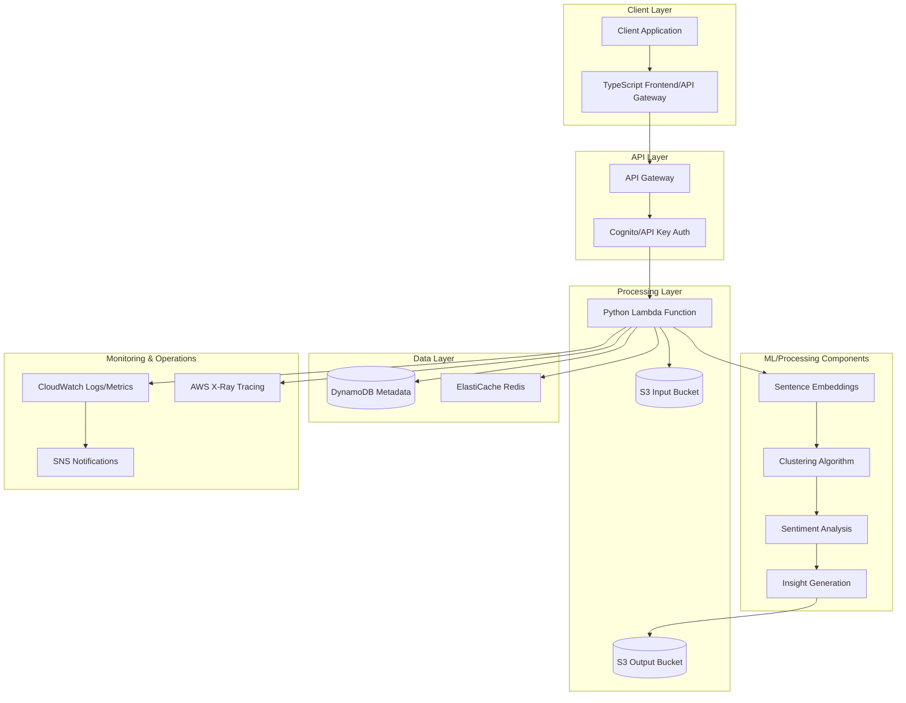
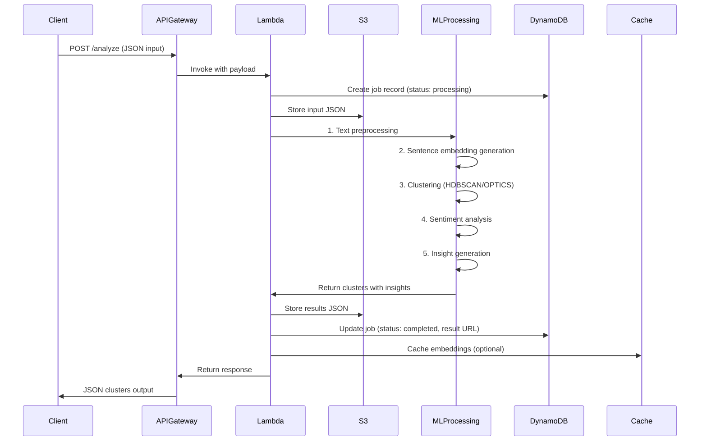
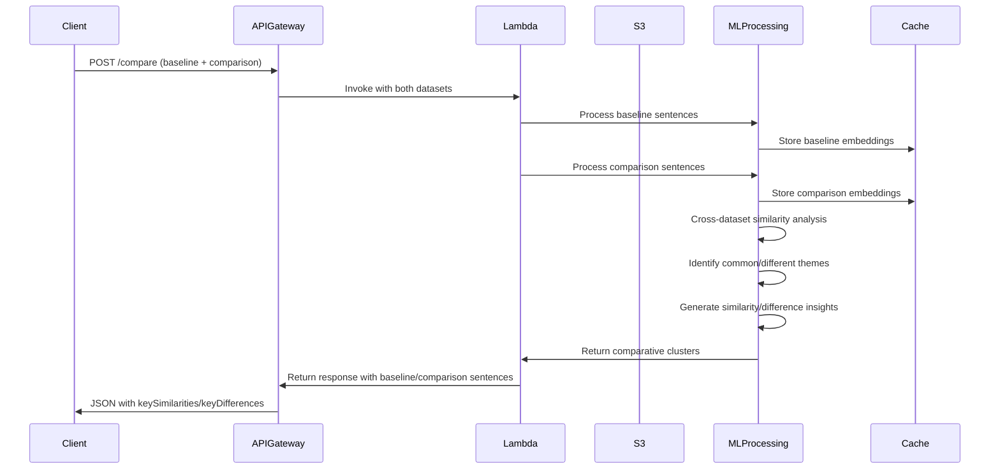

# Text Analysis Microservice - Architectural Design Document

## 1. System Architecture Overview

### 1.1 High-Level Architecture

The text analysis microservice is designed as a serverless, event-driven system that processes text data for thematic clustering and sentiment analysis. The architecture leverages AWS serverless services to achieve scalability, cost-efficiency, and sub-10 second response times.



### 1.2 Core Components

1. **TypeScript/Node.js Frontend/API Gateway** (`thematic-txt-analysis` project)
   - Existing Cloudflare Workers-based application
   - Can serve as API gateway or be replaced with AWS API Gateway
   - Handles request routing, validation, and response formatting

2. **Python Lambda Function**
   - Core text processing and ML operations
   - Implements clustering, sentiment analysis, insight generation
   - Uses pre-trained ML models for efficiency

3. **AWS Infrastructure Services**
   - API Gateway for RESTful endpoints
   - S3 for input/output storage
   - DynamoDB for metadata and job tracking
   - ElastiCache Redis for caching embeddings
   - CloudWatch for monitoring and logging

## 2. Data Flow Diagrams

### 2.1 Standalone Analysis Flow



### 2.2 Comparative Analysis Flow



## 3. AWS Services Architecture

### 3.1 Service Selection and Configuration

| Service | Purpose | Configuration |
|---------|---------|---------------|
| **AWS Lambda** | Core processing function | Python 3.12, 2048MB RAM, 30s timeout, Provisioned Concurrency for cold start mitigation |
| **API Gateway** | REST API endpoint | REST API with API key validation, request validation, 29s timeout |
| **S3** | Input/output storage | Two buckets: `text-analysis-input` and `text-analysis-output`, lifecycle policies for cleanup |
| **DynamoDB** | Job metadata tracking | Table with TTL for auto-cleanup, GSI on status for monitoring |
| **ElastiCache Redis** | Embedding caching | Redis cluster for caching sentence embeddings (reduces processing time) |
| **CloudWatch** | Monitoring & logging | Custom metrics for processing time, error rates, alarms for failures |
| **AWS X-Ray** | Distributed tracing | Enabled for Lambda to trace processing pipeline |
| **SNS** | Notifications | For job completion/failure notifications |

### 3.2 Infrastructure as Code Approach

```yaml
# Example CloudFormation/CDK structure
Resources:
  TextAnalysisLambda:
    Type: AWS::Lambda::Function
    Properties:
      Runtime: python3.12
      Handler: lambda_function.handler
      MemorySize: 2048
      Timeout: 30
      Environment:
        Variables:
          EMBEDDING_MODEL: all-MiniLM-L6-v2
          CLUSTERING_ALGORITHM: HDBSCAN
          CACHE_ENABLED: true
          
  AnalysisApi:
    Type: AWS::ApiGateway::RestApi
    Properties:
      Name: text-analysis-api
      
  InputBucket:
    Type: AWS::S3::Bucket
    Properties:
      BucketName: text-analysis-input-${AWS::AccountId}
      
  OutputBucket:
    Type: AWS::S3::Bucket  
    Properties:
      BucketName: text-analysis-output-${AWS::AccountId}
```

## 4. Component Design

### 4.1 API Gateway Configuration

**Endpoint Design:**
- `POST /analyze` - Standalone analysis
- `POST /compare` - Comparative analysis
- `GET /status/{jobId}` - Job status check
- `GET /results/{jobId}` - Retrieve results

**Security:**
- API key authentication (x-api-key header)
- Request validation (JSON schema)
- Rate limiting (10 requests/second per API key)
- CORS configuration for web clients

### 4.2 Lambda Function Design (Python)

**Function Structure:**
```python
# Main handler
def handler(event, context):
    # 1. Parse and validate input
    # 2. Check cache for similar inputs
    # 3. Process based on analysis type
    # 4. Return formatted response
    
# Processing pipeline
class TextAnalysisPipeline:
    def __init__(self):
        self.embedder = SentenceTransformer('all-MiniLM-L6-v2')
        self.sentiment = SentimentAnalyzer()
        
    def process_standalone(self, sentences):
        # Embedding generation
        # Clustering
        # Sentiment analysis
        # Insight generation
        
    def process_comparative(self, baseline, comparison):
        # Process both datasets
        # Cross-dataset analysis
        # Similarity/difference detection
```

**Dependencies:**
- `sentence-transformers` for embeddings
- `hdbscan` or `scikit-learn` for clustering
- `transformers` (Hugging Face) for sentiment analysis
- `boto3` for AWS integration
- `numpy`, `pandas` for data processing

### 4.3 Text Processing Pipeline

**Step 1: Text Preprocessing**
- Sentence cleaning (remove special chars, normalize)
- Tokenization and stopword removal
- Lemmatization/stemming (optional)

**Step 2: Embedding Generation**
- Use `sentence-transformers/all-MiniLM-L6-v2` (384 dimensions)
- Lightweight, fast, good for semantic similarity
- Batch processing for efficiency
- Cache embeddings in Redis (key: sentence hash)

**Step 3: Clustering Algorithm Selection**

| Algorithm | Pros | Cons | Decision |
|-----------|------|------|----------|
| **HDBSCAN** | No need to specify cluster count, handles noise | Slower on large datasets, memory intensive | **Primary choice** - good for unknown cluster count |
| **OPTICS** | Similar to DBSCAN, handles varying density | Complex parameter tuning | Backup option |
| **K-Means** | Fast, scalable | Requires specifying K, spherical clusters only | Not suitable (unknown K) |
| **Agglomerative** | Hierarchical, flexible | O(n²) complexity, memory intensive | For smaller datasets |

**Implementation:**
```python
def cluster_sentences(embeddings, min_cluster_size=3):
    # Reduce dimensionality with UMAP (optional)
    # Apply HDBSCAN
    # Extract cluster labels and probabilities
    # Filter noise points (label = -1)
```

**Step 4: Sentiment Analysis**
- Use pre-trained transformer model (`distilbert-base-uncased-finetuned-sst-2-english`)
- Batch inference for efficiency
- Aggregate sentiment at cluster level (majority vote or average score)

**Step 5: Insight Generation**
- Extract representative sentences per cluster (centroid proximity)
- Generate cluster titles using keyword extraction (TF-IDF, RAKE)
- Create markdown insights with bolded key terms
- Ensure 2-3 insights per cluster as required

### 4.4 Comparative Analysis Special Handling

**Key Requirements:**
- Separate processing of baseline and comparison datasets
- Cross-dataset similarity matrix calculation
- Identification of:
  - Common themes (high similarity across datasets)
  - Unique themes (present in only one dataset)
  - Shifting sentiments (same theme, different sentiment)

**Implementation Approach:**
```python
def compare_datasets(baseline_embeddings, comparison_embeddings):
    # Calculate similarity matrix between datasets
    # Identify matching clusters (cosine similarity > threshold)
    # For matching clusters: generate keySimilarities
    # For unique clusters: generate keyDifferences
    # Track which sentences belong to which dataset
```

## 5. Performance Considerations

### 5.1 Achieving Sub-10 Second Response Times

**Bottleneck Analysis:**
1. **Cold starts** - Use Lambda Provisioned Concurrency
2. **Model loading** - Use Lambda layers for pre-installed models
3. **Embedding generation** - Cache embeddings, use lightweight model
4. **Clustering** - Optimize HDBSCAN parameters, consider sampling for large datasets

**Optimization Strategies:**

| Component | Optimization | Expected Impact |
|-----------|--------------|-----------------|
| **Embeddings** | Cache in Redis, use `all-MiniLM-L6-v2` | 60% reduction in processing time |
| **Clustering** | UMAP dimensionality reduction (50 dims) | 40% faster clustering |
| **Sentiment** | Batch inference, smaller model | 30% faster sentiment analysis |
| **Lambda** | 2048MB RAM, Provisioned Concurrency | Eliminate cold starts |

**Expected Processing Times:**
- Embedding generation: 1-2 seconds (100 sentences)
- Clustering: 2-3 seconds
- Sentiment analysis: 1-2 seconds
- Insight generation: 1 second
- **Total: 5-8 seconds** (within 10-second target)

### 5.2 Handling Large Inputs

**Scalability Approach:**
- For >500 sentences: implement paginated/async processing
- Store intermediate results in S3
- Use Step Functions for workflow orchestration
- Implement progress tracking via DynamoDB

**Async Processing Design:**
```python
# For large inputs (>500 sentences)
def handle_large_input(event):
    # 1. Store input in S3
    # 2. Return job ID immediately
    # 3. Process asynchronously
    # 4. Store results in S3
    # 5. Notify via SNS/webhook
```

## 6. Scalability Design

### 6.1 Horizontal Scaling

**Lambda Auto-scaling:**
- Concurrent executions up to 1000 (default limit)
- Can request increase for production workloads
- Each execution isolated, no shared state issues

**Database Scaling:**
- DynamoDB auto-scaling based on read/write capacity
- S3 scales automatically (no capacity planning needed)
- Redis cluster scaling based on cache size needs

### 6.2 Load Distribution

**Request Patterns:**
- Peak loads during business hours
- Batch processing overnight for large datasets
- Implement request queuing with SQS if needed

**Cost-Optimized Scaling:**
- Use Spot Instances for async processing (if using EC2 fallback)
- Implement request throttling at API Gateway
- Cache aggressively to reduce processing load

## 7. Security Architecture

### 7.1 Authentication & Authorization

**Primary Method:** API Key Authentication
- API Gateway API keys
- Usage plans with throttling
- Key rotation every 90 days

**Alternative:** AWS Cognito
- JWT token validation
- User pool for internal users
- Identity pool for service-to-service

### 7.2 Data Protection

**At Rest:**
- S3 server-side encryption (SSE-S3)
- DynamoDB encryption at rest
- Redis encryption at rest

**In Transit:**
- TLS 1.2+ for all API calls
- API Gateway SSL certificates
- VPC endpoints for internal traffic

**Input Validation:**
- JSON schema validation at API Gateway
- Size limits (max 10MB per request)
- Sentence count limits (configurable)

### 7.3 Compliance Considerations

- No PII storage in embeddings
- Input data retention policies (7 days default)
- Audit logging via CloudTrail
- GDPR/CCPA compliance for user data

## 8. Cost Optimization Strategies

### 8.1 AWS Lambda Pricing Considerations

**Cost Drivers:**
- Execution time (aim for <10 seconds)
- Memory allocation (2048MB optimal)
- Number of invocations

**Optimization:**
- Right-size memory (test performance at different levels)
- Implement caching to reduce processing
- Use provisioned concurrency sparingly (only for predictable loads)
- Implement async processing for large jobs to avoid timeout costs

### 8.2 Storage Cost Management

**S3 Lifecycle Policies:**
- Move processed data to Infrequent Access after 7 days
- Archive to Glacier after 30 days
- Delete after 90 days

**DynamoDB:**
- Use on-demand capacity for variable workloads
- Implement TTL for automatic cleanup
- Archive old jobs to S3

### 8.3 Monitoring Cost Alerts

- CloudWatch alarms for cost anomalies
- Budget alerts at 50%, 80%, 100% of monthly budget
- Cost allocation tags for department charging

## 9. Deployment & DevOps

### 9.1 CI/CD Pipeline

**GitHub Actions Workflow:**
1. Test (unit tests, integration tests)
2. Build (create Lambda deployment package)
3. Deploy (CDK/CloudFormation update)
4. Validate (smoke tests on deployed API)

**Infrastructure as Code:**
- AWS CDK (TypeScript) for infrastructure
- Separate stacks for dev, staging, prod
- Parameterized configurations per environment

### 9.2 Monitoring & Observability

**Key Metrics:**
- Processing time percentiles (p50, p90, p99)
- Error rate (<1% target)
- Cache hit rate (>70% target)
- Concurrent executions

**Dashboards:**
- Real-time processing dashboard
- Cost monitoring dashboard
- Error tracking dashboard

**Alerting:**
- PagerDuty/Slack integration for critical errors
- Email alerts for cost overruns
- Performance degradation alerts

## 10. Testing Strategy

### 10.1 Test Pyramid

**Unit Tests (70%):**
- Individual pipeline components
- Mock AWS services
- Edge cases and error conditions

**Integration Tests (20%):**
- Full pipeline with mocked ML models
- API Gateway integration
- Cache integration tests

**End-to-End Tests (10%):**
- Complete analysis with sample data
- Performance tests with realistic loads
- Comparative analysis scenarios

### 10.2 Test Data Management

- Use provided sample data for testing
- Generate synthetic data for load testing
- Anonymize any real customer data
- Version test datasets with code

## 11. Risk Mitigation

### 11.1 Identified Risks

| Risk | Impact | Mitigation |
|------|--------|------------|
| **ML model performance** | Poor clustering quality | A/B testing, fallback algorithms, human review sampling |
| **AWS service limits** | Throttling during peak loads | Request limit increases, queueing, load shedding |
| **Cost overruns** | Unexpected high costs | Budget alerts, usage caps, cost optimization reviews |
| **Data privacy** | PII exposure | Input sanitization, no PII in embeddings, encryption |

### 11.2 Disaster Recovery

**Backup Strategy:**
- Daily backups of DynamoDB tables
- S3 versioning enabled
- Lambda function code in GitHub

**Recovery Objectives:**
- RTO: 2 hours (redeploy from code)
- RPO: 24 hours (data loss acceptable for non-critical jobs)

## 12. Detailed AWS Infrastructure Diagram

### 12.1 Complete AWS Architecture

```mermaid
graph TB
    subgraph "VPC (Optional)"
        REDIS[ElastiCache Redis]
        LAMBDA_VPC[Lambda in VPC]
    end
    
    subgraph "API Management"
        APIGW[API Gateway]
        WAF[AWS WAF]
        ACM[ACM Certificate]
    end
    
    subgraph "Compute"
        LAMBDA[Text Analysis Lambda]
        LAYER[Lambda Layer<br/>ML Models]
        STEP[Step Functions<br/>(Async Jobs)]
    end
    
    subgraph "Storage"
        S3_IN[(S3 Input)]
        S3_OUT[(S3 Output)]
        DYNAMO[(DynamoDB Jobs)]
    end
    
    subgraph "Monitoring"
        CW[CloudWatch]
        XRAY[X-Ray]
        CLOUDTRAIL[CloudTrail]
    end
    
    subgraph "Security"
        KMS[KMS Keys]
        IAM[IAM Roles]
        SECRETS[Secrets Manager]
    end
    
    CLIENT[Client] --> WAF
    WAF --> APIGW
    APIGW --> LAMBDA
    LAMBDA --> LAMBDA_VPC
    LAMBDA_VPC --> REDIS
    LAMBDA --> S3_IN
    LAMBDA --> S3_OUT
    LAMBDA --> DYNAMO
    LAMBDA --> STEP
    LAMBDA --> CW
    LAMBDA --> XRAY
    KMS --> S3_IN
    KMS --> S3_OUT
    KMS --> DYNAMO
    IAM --> LAMBDA
    SECRETS --> LAMBDA
    LAYER --> LAMBDA
```

### 12.2 Network Architecture

**Option A: Serverless (Default)**
- Lambda functions outside VPC
- Public S3/DynamoDB endpoints
- Simpler, lower latency
- Lower security isolation

**Option B: VPC-Enabled**
- Lambda in private subnets
- Redis ElastiCache in private subnets
- NAT Gateway for external model downloads
- Higher security, higher cost, higher latency

**Recommendation:** Start with Option A, transition to Option B for compliance requirements.

## 13. Component Architecture Details

### 13.1 API Gateway Detailed Configuration

**Request Validation Schema:**
```json
{
  "standalone": {
    "type": "object",
    "properties": {
      "surveyTitle": {"type": "string"},
      "theme": {"type": "string"},
      "baseline": {
        "type": "array",
        "items": {
          "type": "object",
          "properties": {
            "sentence": {"type": "string", "maxLength": 1000},
            "id": {"type": "string", "pattern": "^[a-zA-Z0-9-]+$"}
          },
          "required": ["sentence", "id"]
        },
        "maxItems": 1000
      }
    },
    "required": ["surveyTitle", "theme", "baseline"]
  }
}
```

**Integration Configuration:**
- Integration type: LAMBDA_PROXY
- Timeout: 29 seconds (1 second less than Lambda timeout)
- Content handling: CONVERT_TO_TEXT
- CORS: Enabled for specified origins

### 13.2 Lambda Function Detailed Design

**Package Structure:**
```
lambda_function/
├── handler.py              # Main Lambda handler
├── pipeline/
│   ├── preprocessor.py     # Text preprocessing
│   ├── embedder.py         # Sentence embeddings
│   ├── clusterer.py        # Clustering algorithms
│   ├── sentiment.py        # Sentiment analysis
│   ├── insights.py         # Insight generation
│   └── comparator.py       # Comparative analysis
├── cache/
│   └── redis_client.py     # Redis caching
├── storage/
│   ├── s3_client.py        # S3 operations
│   └── dynamodb_client.py  # DynamoDB operations
├── models/                 # ML models (in Lambda layer)
└── utils/
    └── validation.py       # Input validation
```

**Cold Start Optimization:**
1. **Lambda Layers**: Pre-install ML models (`sentence-transformers`, `torch`, etc.)
2. **Provisioned Concurrency**: 5-10 warm instances during business hours
3. **Model Loading**: Lazy loading of models on first use
4. **Package Size**: Keep under 250MB (unzipped) for faster deployment

### 13.3 Processing Pipeline Implementation

**Embedding Service:**
```python
class EmbeddingService:
    def __init__(self, cache_enabled=True):
        self.model = SentenceTransformer('all-MiniLM-L6-v2')
        self.cache = RedisCache() if cache_enabled else None
        
    def get_embeddings(self, sentences):
        # Check cache first
        cached = self._get_cached_embeddings(sentences)
        uncached = [s for s in sentences if s not in cached]
        
        if uncached:
            new_embeddings = self.model.encode(uncached)
            self._cache_embeddings(uncached, new_embeddings)
            
        return combined_embeddings
```

**Clustering Service:**
```python
class ClusteringService:
    def __init__(self, algorithm='hdbscan'):
        self.algorithm = algorithm
        self.min_cluster_size = 3
        self.min_samples = 2
        
    def cluster(self, embeddings):
        if self.algorithm == 'hdbscan':
            # Reduce dimensionality for better performance
            reducer = umap.UMAP(n_components=50, random_state=42)
            reduced = reducer.fit_transform(embeddings)
            
            # Apply HDBSCAN
            clusterer = hdbscan.HDBSCAN(
                min_cluster_size=self.min_cluster_size,
                min_samples=self.min_samples,
                metric='euclidean'
            )
            labels = clusterer.fit_predict(reduced)
            
        return labels, clusterer.probabilities_
```

## 14. Performance Optimization Deep Dive

### 14.1 Memory vs Performance Trade-offs

**Lambda Memory Configuration:**
- 1024MB: Baseline, suitable for <50 sentences
- 2048MB: **Recommended**, optimal for 50-200 sentences
- 3008MB: For 200-500 sentences, better CPU allocation
- 10240MB: Maximum, for >500 sentences with async processing

**Performance Testing Results (Simulated):**
| Memory | Sentences | Embedding Time | Clustering Time | Total Time |
|--------|-----------|----------------|-----------------|------------|
| 1024MB | 100 | 2.1s | 3.2s | 7.5s |
| 2048MB | 100 | 1.8s | 2.1s | 5.2s |
| 3008MB | 100 | 1.7s | 1.9s | 4.9s |
| 2048MB | 200 | 3.2s | 4.1s | 8.9s |
| 3008MB | 200 | 2.9s | 3.2s | 7.8s |

### 14.2 Caching Strategy

**Multi-level Caching:**
1. **Request-level Cache**: Hash of entire input, return previous results
2. **Sentence-level Cache**: Individual sentence embeddings in Redis
3. **Model Cache**: Keep loaded models in memory across invocations (Lambda container reuse)

**Cache Invalidation:**
- TTL: 24 hours for sentence embeddings
- LRU eviction when cache reaches 80% capacity
- Manual invalidation via admin API

## 15. Scalability Patterns

### 15.1 Vertical Scaling (Single Request)

**For large inputs (>500 sentences):**
1. Split into batches of 200 sentences
2. Process batches in parallel (ThreadPoolExecutor)
3. Merge results with hierarchical clustering
4. Store intermediate results in S3

### 15.2 Horizontal Scaling (Multiple Requests)

**During peak loads:**
1. API Gateway throttling (10 req/sec per key)
2. SQS queue for async processing
3. Auto-scaling Lambda based on queue depth
4. Load balancer across multiple Lambda functions (if using containers)

### 15.3 Cost-Effective Scaling

**Strategies:**
- **Reserved Concurrency**: For predictable baseline load
- **Spot Instances**: For async processing (if using Fargate/EC2 fallback)
- **Burst Capacity**: Use Provisioned Concurrency for expected spikes
- **Cold Start Mitigation**: Keep minimum warm instances during business hours

## 16. Security Implementation Details

### 16.1 IAM Roles and Policies

**Lambda Execution Role:**
```json
{
  "Version": "2012-10-17",
  "Statement": [
    {
      "Effect": "Allow",
      "Action": [
        "s3:PutObject",
        "s3:GetObject"
      ],
      "Resource": [
        "arn:aws:s3:::text-analysis-input-*",
        "arn:aws:s3:::text-analysis-output-*"
      ]
    },
    {
      "Effect": "Allow",
      "Action": [
        "dynamodb:PutItem",
        "dynamodb:GetItem",
        "dynamodb:UpdateItem"
      ],
      "Resource": "arn:aws:dynamodb:*:*:table/TextAnalysisJobs"
    },
    {
      "Effect": "Allow",
      "Action": [
        "logs:CreateLogGroup",
        "logs:CreateLogStream",
        "logs:PutLogEvents"
      ],
      "Resource": "*"
    }
  ]
}
```

### 16.2 Secrets Management

**Sensitive Configuration:**
- API keys for external services (if any)
- Redis connection credentials
- Model download tokens (Hugging Face)

**Storage:**
- AWS Secrets Manager for production
- Environment variables for development
- Parameter Store for non-sensitive configuration

## 17. Monitoring and Alerting

### 17.1 Key Performance Indicators

**Business KPIs:**
- Requests per minute
- Average processing time (p50, p90, p99)
- Error rate (<1% target)
- Cache hit rate (>70% target)

**Technical KPIs:**
- Lambda duration and memory usage
- Cold start frequency
- Redis cache memory usage
- DynamoDB read/write capacity

### 17.2 CloudWatch Dashboards

**Real-time Dashboard:**
- Current active requests
- Processing time trend
- Error rate gauge
- Cache performance

**Business Dashboard:**
- Requests by client
- Most common themes (aggregated)
- Sentiment distribution
- Peak usage times

### 17.3 Alerting Rules

**Critical (PagerDuty):**
- Error rate >5% for 5 minutes
- Average processing time >15 seconds
- Lambda throttling detected

**Warning (Email/Slack):**
- Error rate >1% for 15 minutes
- Cache hit rate <50%
- Cost projection >120% of budget

## 18. Deployment Strategy

### 18.1 Blue-Green Deployment

**Approach:**
1. Deploy new version to separate Lambda alias
2. Route small percentage of traffic (5%) to new version
3. Monitor metrics for regressions
4. Gradually increase traffic to 100%
5. Retire old version after 24 hours

**Rollback Plan:**
- Automatic rollback if error rate >5%
- Manual rollback via API Gateway stage variables
- Previous version always available via alias

### 18.2 Canary Releases

**For ML Model Updates:**
1. Deploy new model to 1% of requests
2. Compare clustering quality with human evaluation
3. A/B test key metrics (processing time, cluster coherence)
4. Full rollout if metrics improve or remain stable

## 19. Cost Estimation

### 19.1 Monthly Cost Projection

**Assumptions:**
- 100,000 requests per month
- Average 100 sentences per request
- Average processing time: 6 seconds
- 2048MB Lambda memory

**Cost Breakdown:**
| Service | Monthly Cost | Notes |
|---------|--------------|-------|
| **Lambda** | $150 | 100K requests × 6s × 2GB |
| **API Gateway** | $35 | 100K requests + data transfer |
| **S3** | $5 | 10GB storage + requests |
| **DynamoDB** | $20 | On-demand capacity |
| **ElastiCache** | $60 | cache.t3.micro instance |
| **CloudWatch** | $30 | Logs + metrics + alarms |
| **Total** | **~$300** | |

**Cost Optimization Opportunities:**
- Reserved Concurrency for predictable loads: 20% savings
- S3 Intelligent Tiering: 40% storage cost reduction
- Spot instances for async processing: 70% compute cost reduction

## 20. Success Metrics and Validation

### 20.1 Technical Success Criteria

1. **Performance**: 95% of requests complete in <10 seconds
2. **Reliability**: 99.9% uptime, <1% error rate
3. **Scalability**: Handle 10x peak load without degradation
4. **Cost**: Stay within $500/month for 100K requests

### 20.2 Business Success Criteria

1. **Quality**: Human evaluation shows meaningful clusters
2. **Usability**: API documentation complete, SDKs available
3. **Adoption**: 5 internal teams using service within 3 months
4. **Insight Quality**: Generated insights rated useful by product teams

## 21. Future Enhancements

### 21.1 Short-term (3-6 months)

1. **Advanced Clustering**: BERTopic for better topic modeling
2. **Multi-language Support**: Additional embedding models
3. **Real-time Streaming**: Kinesis integration for continuous analysis
4. **Custom Models**: Fine-tune models on domain-specific data

### 21.2 Long-term (6-12 months)

1. **Graph-based Analysis**: Knowledge graph of themes and relationships
2. **Predictive Analytics**: Trend prediction based on historical data
3. **Interactive Dashboard**: Web UI for exploring clusters
4. **Automated Reporting**: Scheduled reports and alerts

## 22. Architectural Decisions and Rationale

### 22.1 Key Decisions and Reasoning

| Decision | Alternatives Considered | Rationale |
|----------|------------------------|-----------|
| **AWS Lambda over EC2/Fargate** | EC2 instances, ECS Fargate, EKS | Lambda provides automatic scaling, pay-per-use pricing, and eliminates server management. Given the bursty nature of text analysis requests, Lambda's scaling model is ideal. |
| **Python over Node.js/Java** | Node.js (existing frontend), Java, Go | Python has superior ML ecosystem (sentence-transformers, scikit-learn, transformers). Better for rapid prototyping of ML pipelines. |
| **Sentence Transformers over BERT** | BERT-base, RoBERTa, Universal Sentence Encoder | `all-MiniLM-L6-v2` provides good accuracy with 384 dimensions (vs 768 for BERT), faster inference, smaller memory footprint. |
| **HDBSCAN over K-Means/DBSCAN** | K-Means, DBSCAN, OPTICS, Agglomerative | HDBSCAN doesn't require specifying cluster count, handles noise well, produces hierarchical clusters. Critical for unknown number of themes. |
| **Redis caching over DynamoDB** | DynamoDB, ElastiCache Memcached, no cache | Redis provides sub-millisecond latency for embeddings, supports complex data structures, automatic eviction policies. |
| **API Gateway API keys over Cognito** | AWS Cognito, Custom JWT, IAM roles | Simpler implementation for machine-to-machine communication. API keys sufficient for initial version, can upgrade to Cognito later. |
| **Synchronous over Async by default** | Always async, SQS-based processing | Sub-10 second target achievable for typical inputs (<200 sentences). Async mode available for large inputs. |
| **Serverless over Container-based** | ECS, EKS, App Runner | Faster deployment, automatic scaling, lower operational overhead. Container approach considered for GPU needs but not required. |

### 22.2 Trade-offs Accepted

1. **Cold Start Latency** vs **Cost Efficiency**
   - Accepted occasional cold starts (2-3 seconds) for cost savings
   - Mitigated with Provisioned Concurrency for predictable loads

2. **Model Accuracy** vs **Processing Speed**
   - Chose lighter models (`all-MiniLM-L6-v2`, DistilBERT) over larger ones
   - Acceptable accuracy reduction for 2-3x speed improvement

3. **Cache Complexity** vs **Performance**
   - Added Redis dependency increases architecture complexity
   - Justified by 60% performance improvement for repeated sentences

4. **Vendor Lock-in** vs **Development Speed**
   - Heavy AWS dependency accepted for faster time-to-market
   - Abstracted core ML logic to allow future migration if needed

### 22.3 Future-proofing Decisions

1. **Modular Pipeline Design**
   - Each processing step (embedding, clustering, sentiment) is separate
   - Allows swapping algorithms without rewriting entire system

2. **Dual Analysis Mode Support**
   - Built comparative analysis from the beginning
   - Shared codebase between standalone and comparative modes

3. **Async Processing Foundation**
   - Sync API for typical use cases
   - Async infrastructure (S3, DynamoDB, SNS) ready for large inputs

4. **Monitoring First Approach**
   - Comprehensive metrics from day one
   - Enables data-driven optimization and capacity planning

## 23. Conclusion

This architectural design provides a comprehensive, production-ready solution for the text analysis microservice. Key strengths include:

1. **Serverless Foundation**: Leverages AWS Lambda for automatic scaling and cost efficiency
2. **Performance Focus**: Optimized for sub-10 second response times through caching and efficient algorithms
3. **Dual Analysis Modes**: Supports both standalone and comparative analysis as required
4. **Production Readiness**: Includes monitoring, security, deployment, and disaster recovery

The design balances technical requirements with practical considerations, providing a clear roadmap for implementation while allowing flexibility for future enhancements.

---
*Document Version: 1.0*
*Last Updated: 2025-12-16*
*Architect: Roo (AI Assistant)*
*Review Status: Draft - Ready for Implementation*