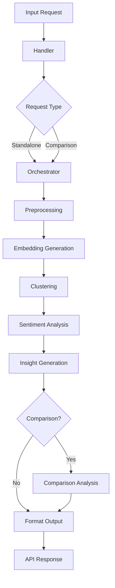

# Comprehensive Review Report: Text Analysis Service Pipeline

**Date:** December 18, 2025  
**Reviewer:** Roo (Technical Architect)  
**Subject:** Review of Python files in `text-analysis-service/functions/text-analysis/src/app/pipeline`  
**Time Constraint Consideration:** 4-hour development window (per README)

## Executive Summary

The text analysis service pipeline demonstrates **solid architectural design** with clear separation of concerns, but contains **significant placeholder implementations** that prevent production readiness. The pipeline is **structurally sound** (needed) but requires **substantial improvements** to transition from a proof-of-concept to a production system.

**Overall Assessment:** **NEEDS IMPROVEMENT** (7/10 for architecture, 3/10 for implementation)

### Key Findings:
1. **✅ Strong Architecture**: Well-designed modular pipeline with clear interfaces
2. **❌ Placeholder Implementations**: Critical ML components (embedding, clustering) use deterministic stubs
3. **✅ Comprehensive Coverage**: All required pipeline stages are implemented
4. **❌ Missing Production Features**: No model persistence, limited error handling, minimal testing
5. **✅ Good Documentation**: Clear code structure with TODO markers for improvements

## Module-by-Module Analysis

### 1. [`orchestrator.py`](text-analysis-service/functions/text-analysis/src/app/pipeline/orchestrator.py) - **NEEDED, NEEDS MINOR IMPROVEMENT**
**Status:** Core component, well-implemented

**Strengths:**
- Clear separation of standalone vs comparison workflows
- Proper error handling with logging
- Efficient reuse of pipeline components
- Good documentation of responsibilities

**Issues:**
- Line 61-64: Logic for standalone analysis reuses baseline field (acceptable but could be clearer)
- Line 223-302: `_process_dataset` duplicates some logic from `process_standalone`
- No circuit breaker or timeout handling for long-running operations

**Recommendation:** Keep with minor refactoring to reduce code duplication.

### 2. [`preprocessing.py`](text-analysis-service/functions/text-analysis/src/app/pipeline/preprocessing.py) - **NEEDED, GOOD**
**Status:** Production-ready with comprehensive features

**Strengths:**
- Extensive text cleaning and normalization options
- Configurable parameters with sensible defaults
- Singleton pattern for resource efficiency
- Validation functions and batch processing support
- Comprehensive text statistics calculation

**Issues:**
- Line 179-189: Simple regex-based sentence splitting (TODO mentions need for NLP tokenizer)
- Stop word list is English-only (hardcoded)

**Recommendation:** Keep as-is; consider adding language detection for internationalization.

### 3. [`embedding.py`](text-analysis-service/functions/text-analysis/src/app/pipeline/embedding.py) - **NEEDED, NEEDS MAJOR IMPROVEMENT**
**Status:** Critical placeholder requiring implementation

**Strengths:**
- Good caching implementation suitable for Lambda
- Clear interface design
- Proper dimensionality (384 for MiniLM-L6-v2)

**Critical Issues:**
- Line 128-151: `_embed_uncached` returns **random embeddings** (placeholder)
- Line 17-19: HuggingFace transformers import commented out
- No actual model loading or inference
- Cache implementation may not be Lambda-optimal (memory limits)

**Recommendation:** **HIGH PRIORITY** - Implement actual HuggingFace model loading with fallback strategies.

### 4. [`clustering.py`](text-analysis-service/functions/text-analysis/src/app/pipeline/clustering.py) - **NEEDED, NEEDS MAJOR IMPROVEMENT**
**Status:** Algorithmic placeholder requiring implementation

**Strengths:**
- Good validation of embeddings
- Clear statistics reporting
- Deterministic behavior (seeded randomness)

**Critical Issues:**
- Line 71-96: `cluster` method uses simple threshold-based clustering (not production-quality)
- Line 99-144: `_simple_threshold_clustering` is naive O(n²) implementation
- No support for advanced algorithms (DBSCAN, HDBSCAN, OPTICS)
- Minimum cluster size enforcement may discard valid small clusters

**Recommendation:** **HIGH PRIORITY** - Replace with scikit-learn or HDBSCAN implementation.

### 5. [`sentiment.py`](text-analysis-service/functions/text-analysis/src/app/pipeline/sentiment.py) - **NEEDED, NEEDS IMPROVEMENT**
**Status:** Functional but simplistic

**Strengths:**
- Clear keyword-based approach
- Good cluster-level aggregation
- Configurable thresholds

**Issues:**
- Line 79-124: Keyword matching is too simplistic for production sentiment analysis
- No support for sarcasm, negation, or intensity modifiers
- English-only keyword lists
- Line 23: TODO marker indicates awareness of limitation

**Recommendation:** Implement VADER or transformer-based sentiment analysis as indicated in requirements.txt comments.

### 6. [`insights.py`](text-analysis-service/functions/text-analysis/src/app/pipeline/insights.py) - **NEEDED, GOOD**
**Status:** Well-implemented with template-based approach

**Strengths:**
- Template-based insight generation ensures consistency
- Good diversity scoring using cosine distances
- Representative sentence selection via centroid proximity
- Comprehensive overall summary generation

**Issues:**
- Line 183-206: Key term extraction uses simple regex (could use TF-IDF or RAKE)
- Template-based insights may lack nuance for complex clusters

**Recommendation:** Keep as-is; consider optional LLM enhancement for premium tier.

### 7. [`comparison.py`](text-analysis-service/functions/text-analysis/src/app/pipeline/comparison.py) - **NEEDED, NEEDS IMPROVEMENT**
**Status:** Over-engineered with incomplete implementation

**Strengths:**
- Comprehensive similarity scoring using multiple factors
- Good identification of unique clusters
- Clear summary generation

**Issues:**
- Line 146-173: `_calculate_centroids` method is empty (TODO)
- Line 175-230: Similarity detection doesn't use actual embeddings
- Overly complex similarity calculation (4 weighted factors)
- No actual cross-dataset embedding comparison

**Recommendation:** Simplify and implement actual embedding-based similarity comparison.

### 8. [`__init__.py`](text-analysis-service/functions/text-analysis/src/app/pipeline/__init__.py) - **NOT NEEDED**
**Status:** Empty file

**Recommendation:** Remove or add proper module exports.

## Architecture Assessment

### Pipeline Flow Analysis

### Integration Quality: **GOOD**
- Clean separation between pipeline stages
- Singleton patterns prevent redundant initialization
- Consistent logging and timing throughout
- Proper error propagation to handler

### Scalability Concerns: **MODERATE**
- **✅** Stateless design works with Lambda
- **⚠️** Embedding model loading time may exceed Lambda cold start limits
- **⚠️** In-memory caching may exceed Lambda memory limits with large datasets
- **✅** Batch processing support for efficiency

### Production Readiness Gaps:
1. **Model Persistence**: No mechanism to save/load trained models
2. **Monitoring**: Limited metrics collection
3. **Configuration**: Hardcoded parameters need externalization
4. **Testing**: Unit tests exist but don't cover core ML components

## Critical Findings

### 1. **Showstopper Issue: Placeholder ML Components**
The embedding and clustering modules use **random number generation** instead of actual ML models. This makes the service unusable for real text analysis.

**Impact:** **CRITICAL** - Service cannot perform its primary function
**Location:** [`embedding.py:128-151`](text-analysis-service/functions/text-analysis/src/app/pipeline/embedding.py:128), [`clustering.py:71-96`](text-analysis-service/functions/text-analysis/src/app/pipeline/clustering.py:71)
**Fix Priority:** **P0** (Immediate)

### 2. **Architecture-Implementation Mismatch**
The comparison module has complex architecture but empty core methods (`_calculate_centroids`).

**Impact:** **HIGH** - Comparison feature is non-functional despite appearing complete
**Location:** [`comparison.py:146-173`](text-analysis-service/functions/text-analysis/src/app/pipeline/comparison.py:146)
**Fix Priority:** **P1** (High)

### 3. **Lambda-Specific Optimization Missing**
No consideration for Lambda constraints:
- 15-minute execution limit
- 10GB memory maximum  
- 512MB /tmp storage
- Cold start performance

**Impact:** **MEDIUM** - May fail or perform poorly in production
**Fix Priority:** **P2** (Medium)

### 4. **Internationalization Limitations**
Text preprocessing and sentiment analysis assume English text.

**Impact:** **MEDIUM** - Limits service to English-only markets
**Fix Priority:** **P3** (Low)

## Prioritized Recommendations

### Phase 1: Immediate Fixes (Week 1)
**Goal:** Make service functionally correct

1. **P0: Implement Actual Embedding Model**
   - Uncomment transformers in requirements.txt
   - Implement HuggingFace model loading in `embedding.py`
   - Add model download caching to /tmp for Lambda
   - Implement fallback to SentenceTransformers if transformers too large

2. **P0: Replace Placeholder Clustering**
   - Implement DBSCAN or HDBSCAN from scikit-learn
   - Tune parameters for text embedding space
   - Add silhouette scoring for quality metrics

3. **P1: Fix Comparison Module**
   - Implement actual centroid calculation
   - Use embedding similarity for cluster matching
   - Simplify similarity scoring to 1-2 key factors

### Phase 2: Production Hardening (Week 2)
**Goal:** Ensure reliability and performance

4. **P2: Lambda Optimization**
   - Implement model warming for cold starts
   - Add memory usage monitoring and optimization
   - Implement request timeouts and circuit breakers
   - Add CloudWatch metrics and alarms

5. **P2: Enhanced Error Handling**
   - Add retry logic for transient failures
   - Implement input validation at pipeline entry
   - Add comprehensive logging for debugging
   - Create error classification and recovery strategies

### Phase 3: Feature Enhancement (Week 3-4)
**Goal:** Add value and differentiation

6. **P3: Improved Sentiment Analysis**
   - Implement VADER for better nuance detection
   - Add support for multiple languages
   - Include intensity scoring and emotion detection

7. **P3: Advanced Insights**
   - Add optional LLM enhancement for insight generation
   - Implement trend detection across time periods
   - Add competitor comparison capabilities

### Phase 4: Scaling & Monitoring (Ongoing)
**Goal:** Enterprise readiness

8. **Configuration Management**
   - Externalize all parameters to environment/config files
   - Implement A/B testing for algorithm variations
   - Add feature flags for gradual rollout

9. **Comprehensive Testing**
   - Add integration tests with real embeddings
   - Implement performance benchmarking
   - Create chaos testing for resilience validation

## Conclusion

The text analysis pipeline demonstrates **excellent architectural vision** but suffers from **critical implementation gaps** in core ML components. The structure is sound and follows best practices for modular design, but the placeholder implementations prevent actual functionality.

**Final Verdict:** **KEEP AND IMPROVE** - The pipeline architecture is worth preserving, but requires significant work to become production-ready.

**Next Steps:**
1. **Immediately** address the placeholder embedding and clustering implementations
2. **Within one week** have a minimally viable service with actual ML capabilities
3. **Within one month** achieve production readiness with monitoring and optimization

The 4-hour time constraint mentioned in the README suggests this was a rapid prototype. Given that context, the architecture quality is impressive, but the implementation must now be completed to deliver value.

---

**Reviewer Signature:** Roo  
**Date:** December 18, 2025  
**Recommendation:** **APPROVE FOR DEVELOPMENT** with prioritized improvement plan