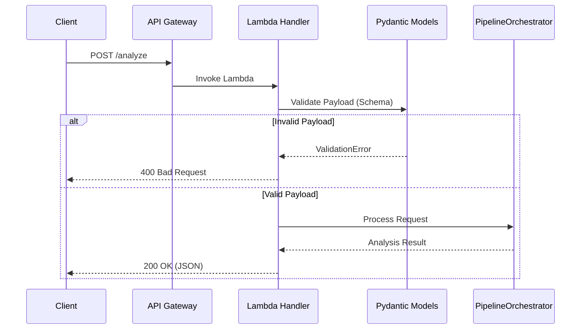

# API and Entry Point Architecture

The API structure of the Text Analysis Service is designed to be compliant with OpenAPI standards, serverless-native, and rigorously validated.

## Overview

- **Framework**: `aws-lambda-powertools` (APIGatewayRestResolver)
- **Validation**: `pydantic` schemas for strong type checking.
- **Documentation**: Auto-generated OpenAPI (Swagger) specs.
- **Endpoint**: `/analyze` (Unified POST endpoint).

## Architecture Diagram



## API Schemas (`src/app/api/schemas.py`)

The API relies on Pydantic models to enforce data integrity before any processing begins.

### Input Models
- **`Sentence`**: 
    - `sentence` (str, 1-1000 chars)
    - `id` (str, unique)
- **`StandaloneInput`**:
    - `surveyTitle` (str)
    - `theme` (str)
    - `baseline` (List[Sentence])
- **`ComparisonInput`**:
    - `surveyTitle` (str)
    - `theme` (str)
    - `baseline` (List[Sentence])
    - `comparison` (List[Sentence])

### Output Models
- **`ClusterInsight`**: Represents a single cluster found in the analysis.
- **`StandaloneOutput`**: Contains a list of `ClusterInsight` + metadata.
- **`ComparisonOutput`**: Contains list of `ComparisonCluster` + metadata + similarity score.

## Handler Logic (`src/app/handler.py`)

The Lambda handler (`analyze`) serves as the entry point and is decorated with Powertools utilities for observability and routing.

```python
@app.post("/analyze")
@tracer.capture_method
def analyze(payload: Union[ComparisonInput, StandaloneInput] = Body(...)) -> Dict[str, Any]:
    # ...
```

1.  **Routing**: The `APIGatewayRestResolver` routes the request to the `analyze` function based on path and method.
2.  **Parsing**: The `Body(...)` parameter automatically parses the JSON body into the appropriate Pydantic model (`ComparisonInput` or `StandaloneInput`).
3.  **Dispatch**: Logic inspects the payload type (`isinstance`) and dispatches to either `process_comparison` or `process_standalone` in the Orchestrator.
4.  **Response**: Returns a dictionary which is automatically serialized to JSON with correct HTTP headers.

## Error Handling (`src/app/api/errors.py`)

A centralized error handling module ensures consistent API responses.
- **Exceptions**: Custom exceptions like `ValidationError`, `ProcessingError`, `ServiceUnavailableError`.
- **Response Format**: Standardized JSON error response.

```json
{
  "error": "VALIDATION_ERROR",
  "message": "Invalid input data",
  "status_code": 400,
  "details": { "field_errors": [...] }
}
```

## Best Practices Implemented
1.  **Validation at the Edge**: Invalid requests are rejected immediately, saving compute costs.
2.  **Self-Documenting**: The code defines the schema, which generates the OpenAPI documentation.
3.  **Unified Endpoint**: A single endpoint `/analyze` handles both modes, simplifying client integration.
