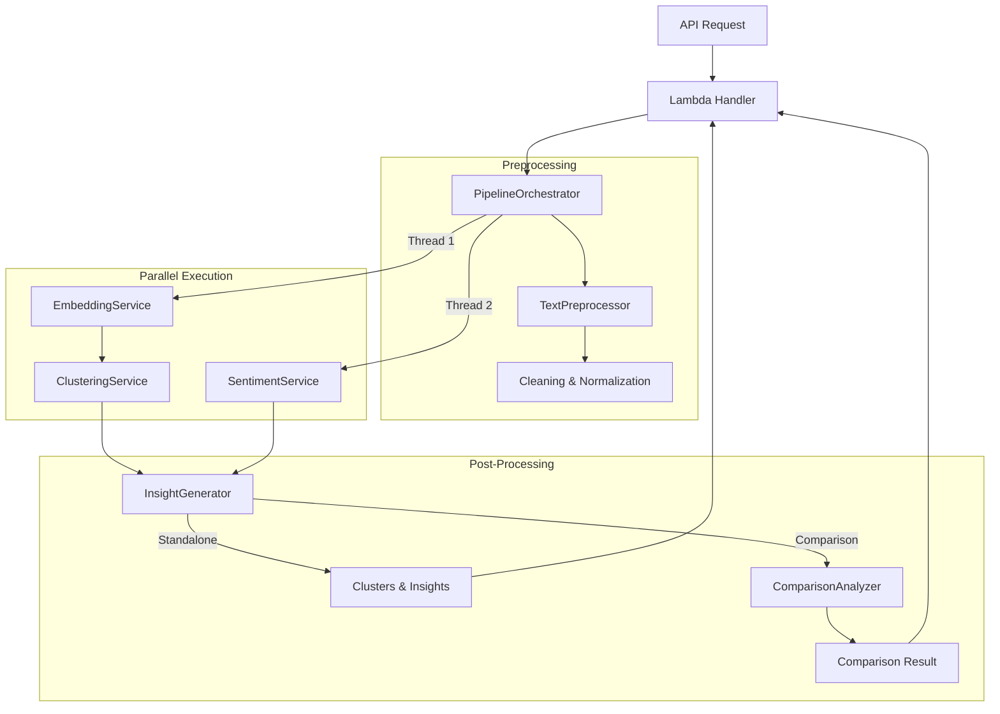

# Core Pipeline Architecture

The Core Pipeline is the heart of the Text Analysis Service, responsible for processing text data into meaningful insights. It is designed to be modular, efficient, and deterministic.

## Overview

The pipeline is managed by the `PipelineOrchestrator`, which coordinates the data flow between various ML services. It handles two main modes of operation:
1.  **Standalone Analysis**: Analyzes a single dataset to find clusters and insights.
2.  **Comparative Analysis**: Compares a baseline dataset against a comparison dataset.

## Architecture Diagram

## Components

### 1. Orchestrator (`src/app/pipeline/orchestrator.py`)
The `PipelineOrchestrator` is the central controller.
- **Responsibilities**: 
    - Validates inputs.
    - Manages concurrency (runs sentiment analysis in parallel with embedding/clustering).
    - Routes data to appropriate services.
    - Aggregates results into the final output format.
- **Concurrency**: Uses `concurrent.futures.ThreadPoolExecutor` to optimize latency by running independent tasks in parallel.

### 2. Preprocessing (`src/app/pipeline/preprocessing.py`)
The `TextPreprocessor` handles text cleaning before analysis.
- **Operations**: Lowercasing, punctuation removal, unicode normalization, stop word removal (optional).
- **Validation**: Filters out invalid or too short/long sentences.

### 3. Machine Learning Services
The system uses an interface-based design (`src/app/pipeline/interfaces.py`) to allow swapping implementations.

#### Embedding (`src/app/pipeline/embedding.py`)
- **Interface**: `EmbeddingService`
- **Implementation**: `HuggingFaceEmbeddingService`
- **Model**: `sentence-transformers/all-MiniLM-L6-v2` (optimized for speed/performance balance).
- **Features**: Includes in-memory caching (`LRU`) to reduce redundant computations in Lambda warm starts.

#### Clustering (`src/app/pipeline/clustering.py`)
- **Interface**: `ClusteringService`
- **Implementation**: `SklearnClusteringService`
- **Algorithm**: DBSCAN (Density-Based Spatial Clustering of Applications with Noise).
- **Benefit**: Does not require specifying the number of clusters (k) beforehand; handles noise gracefully.

#### Sentiment (`src/app/pipeline/sentiment.py`)
- **Interface**: `SentimentService`
- **Implementation**: `VaderSentimentService`
- **Algorithm**: VADER (Rule-based sentiment analysis).
- **Benefit**: Fast, efficient, and works well without training data; capable of handling nuance better than simple polarity checks.

### 4. Insight Generation (`src/app/pipeline/insights.py`)
The `InsightGenerator` creates human-readable summaries and titles for clusters.
- **Philosophy**: Deterministic template-based generation (no LLM hallucinations).
- **Outputs**:
    - **Cluster Titles**: Derived from frequent key terms.
    - **Insights**: Bullet points based on cluster size, sentiment distribution, and diversity.
    - **Summaries**: Rule-based text generation.

### 5. Comparison Logic (`src/app/pipeline/comparison.py`)
The `ComparisonAnalyzer` handles the logic for the "Comparison" mode.
- **Method**: Post-processes clustered data to find overlaps.
- **Metrics**: 
    - Similarity scoring between baseline and comparison clusters.
    - Identification of unique themes in each dataset.
    - Detection of sentiment shifts between similar topics.

## Data Flow

1.  **Input**: Raw text sentences with IDs.
2.  **Preprocessing**: Clean text.
3.  **Vectorization**: Convert text to dense vectors (Embeddings).
4.  **Clustering**: Group vectors by density (DBSCAN).
5.  **Sentiment**: Score each sentence (VADER).
6.  **Aggregation**: 
    - Calculate cluster-level sentiment (weighted averages).
    - Extract key terms per cluster.
7.  **Insight Generation**: Apply templates to aggregated data.
8.  **Output**: Structured JSON with clusters, metadata, and insights.
