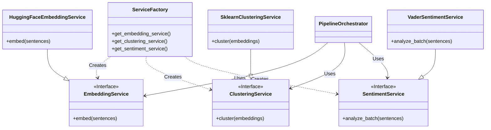

# Dependency Injection and Service Factory

To ensure modularity, testability, and flexibility, the Text Analysis Service utilizes a Dependency Injection (DI) pattern managed by a centralized Service Factory. This allows for easy swapping of underlying ML implementations without modifying the core business logic.

## Design Pattern

The application follows a **Lazy-Loaded Singleton Factory** pattern. 
- **Singleton**: Ensures that heavy resources (like ML models) are loaded only once per Lambda container lifecycle.
- **Lazy Loading**: Models are initialized only when first requested, not at import time, reducing cold start times for paths that may not need specific models.
- **Interface-Based**: All services implement abstract base classes (`ABC`), decoupling the orchestrator from specific implementations.

## Architecture Diagram



## Configuration

The `ServiceFactory` determines which implementation to instantiate based on environment variables. This allows changing providers via configuration (e.g., in `template.yaml` or AWS Lambda environment settings) without code changes.

### Supported Providers

| Service | Environment Variable | Default | Options |
|---------|---------------------|---------|---------|
| **Embedding** | `EMBEDDING_PROVIDER` | `local_hf` | `local_hf` (HuggingFace Local), `openai` (Planned), `bedrock` (Planned) |
| **Clustering** | `CLUSTERING_PROVIDER` | `sklearn` | `sklearn` (Scikit-Learn DBSCAN) |
| **Sentiment** | `SENTIMENT_PROVIDER` | `vader` | `vader`, `transformers` (Planned) |

## Implementation Details (`src/app/pipeline/factory.py`)

### Lazy Initialization
Services are stored as class-level variables (`_embedding_service`, etc.) initially set to `None`. The getter methods check if the instance exists; if not, they instantiate it based on the config.

```python
@classmethod
def get_embedding_service(cls) -> EmbeddingService:
    if cls._embedding_service is None:
        # Load config and instantiate
        cls._embedding_service = HuggingFaceEmbeddingService()
    return cls._embedding_service
```

### Dependency Injection in Orchestrator
The `PipelineOrchestrator` accepts service instances in its constructor. If they are not provided, it defaults to asking the `ServiceFactory` for them.

```python
class PipelineOrchestrator:
    def __init__(
        self,
        embedding_service: Optional[EmbeddingService] = None,
        # ... other services
    ):
        self.embedding_service = embedding_service or ServiceFactory.get_embedding_service()
        # ...
```

This pattern is crucial for **Unit Testing**. Tests can pass mock objects implementing the interfaces directly to the orchestrator, bypassing the heavy ML models and avoiding the need for the `ServiceFactory` during isolated tests.

## Benefits
1.  **Testability**: Core logic can be tested with lightweight mocks.
2.  **Flexibility**: Switching from local models to API-based models (e.g., OpenAI) is a config change.
3.  **Performance**: Controls memory usage by ensuring singletons and lazy loading.
