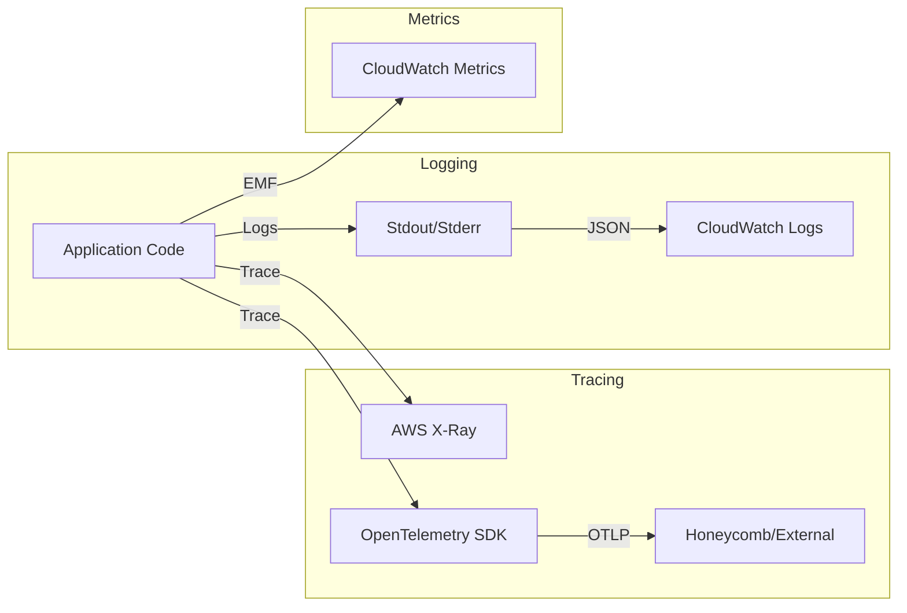

# Observability Architecture

The Text Analysis Service implements a comprehensive observability stack, integrating **Logging**, **Tracing**, and **Metrics** to monitor performance and debug issues effectively in a serverless environment.

## Overview

- **Logging**: Structured JSON logging via `logging` module and `aws-lambda-powertools`.
- **Tracing**: Distributed tracing via `aws-lambda-powertools` (X-Ray) and `opentelemetry` (Honeycomb/OTLP).
- **Metrics**: Custom metrics via `aws-lambda-powertools` (CloudWatch).
- **Timing**: High-resolution performance timing for code blocks.

## Components

### 1. Logging (`src/app/utils/logging.py`)

The logging system is designed for both human readability (local dev) and machine parsing (cloud).

- **Format**: Configurable between plain text (default for local) and structured JSON (default for Lambda).
- **Structured Fields**:
    - `timestamp`, `level`, `message`
    - `module`, `function`, `line`
    - AWS Context: `aws_region`, `lambda_function_name`, `lambda_version`
- **Powertools Integration**: The handler initializes the Powertools `Logger` service, which injects context (e.g., `job_id`) into all subsequent log entries.

```python
# Example Usage
logger.info("Starting analysis", extra={"job_id": "123"})
```

### 2. Tracing (`src/app/utils/telemetry.py`)

The service supports dual tracing mechanisms:

1.  **AWS X-Ray (via Powertools)**:
    - Integrated directly into the Lambda handler.
    - Captures initialization, handler execution, and cold starts.
    - Decorator `@tracer.capture_method` is used to trace critical functions like `analyze`.

2.  **OpenTelemetry (OTLP)**:
    - Configured in `src/app/utils/telemetry.py`.
    - Exports traces to OTLP-compatible backends (e.g., Honeycomb).
    - Activated via environment variables (`OTEL_EXPORTER_OTLP_ENDPOINT`, `OTEL_EXPORTER_OTLP_HEADERS`).
    - Uses `BatchSpanProcessor` for efficient export.

### 3. Metrics (`src/app/handler.py`)

Custom business metrics are emitted to CloudWatch using `aws-lambda-powertools`.

- **Namespace**: `TextAnalysis`
- **Standard Metrics**:
    - `ColdStart` (Count)
    - `ServiceException` (Count)
- **Extensibility**: The `Metrics` object is available to record custom metrics (e.g., `SentencesProcessed`, `ClustersFound`).

### 4. Performance Timing (`src/app/utils/timing.py`)

A specialized module for measuring code block execution time with high precision.

- **Timer Class**: Context manager for timing specific blocks.
    ```python
    with Timer("embedding_generation") as t:
        model.embed(sentences)
    # Logs: "Timer 'embedding_generation': 150.42 ms"
    ```
- **Decorators**: `@timeit` decorator to auto-instrument functions.
- **Performance Monitor**: Aggregates stats (avg, min, max) for repetitive operations.

## Data Flow for Observability



## Configuration

Observability behavior is controlled via environment variables:

| Variable | Description | Default |
|----------|-------------|---------|
| `LOG_LEVEL` | Logging verbosity | `INFO` |
| `POWERTOOLS_SERVICE_NAME` | Service name for Powertools | `text-analysis-service` |
| `POWERTOOLS_METRICS_NAMESPACE` | Namespace for custom metrics | `TextAnalysis` |
| `OTEL_EXPORTER_OTLP_ENDPOINT` | Endpoint for OTLP traces | (None) |
| `OTEL_EXPORTER_OTLP_HEADERS` | Headers (API Key) for OTLP | (None) |

## Best Practices
1.  **Correlation IDs**: Used to track requests across the entire lifecycle.
2.  **Structured Data**: Always use `extra={...}` or Powertools `append_keys()` to add context, never string concatenation.
3.  **Sampling**: Tracing samples a percentage of requests to manage costs (configurable).
