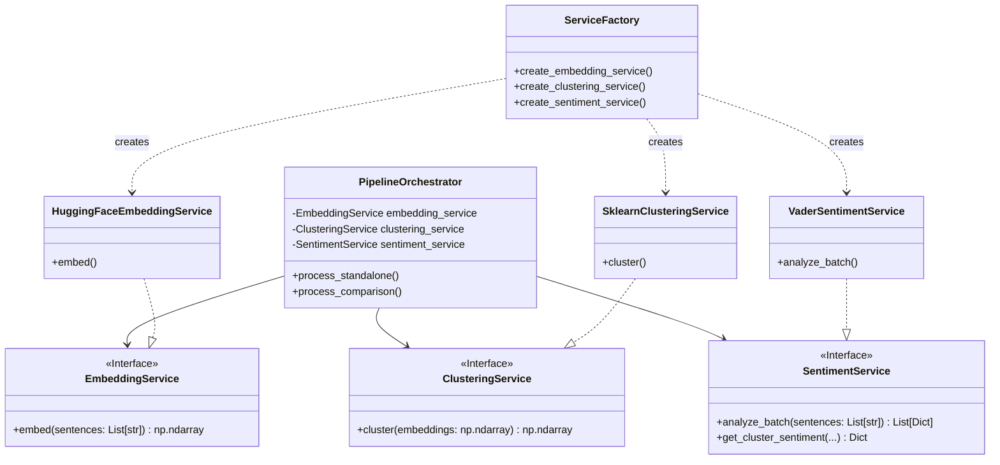

# ML Dependency Injection & Architecture Plan

## 1. Problem Statement

The current text analysis pipeline in `text-analysis-service/src/app/pipeline/` exhibits **tight coupling** between the `PipelineOrchestrator` and specific concrete ML implementations (`EmbeddingModel`, `ClusterAnalyzer`, `SentimentAnalyzer`).

**Issues:**
*   **Rigidity:** Changing the embedding model (e.g., to OpenAI or Bedrock) requires modifying the Orchestrator code.
*   **Testing:** Unit testing the Orchestrator requires mocking complex concrete classes rather than simple interfaces.
*   **Lambda Cold Starts:** The Orchestrator instantiates all models in its `__init__`, causing eager loading of heavy dependencies (like PyTorch/Transformers) even if they might not be used or if a lighter implementation is desired.
*   **Configuration:** There is no centralized way to switch model backends via configuration.

## 2. Proposed Architecture

We will adopt a **Dependency Injection (DI)** pattern using a **Service Factory**. This separates the *usage* of ML capabilities (in the Orchestrator) from their *creation* and *implementation*.

### 2.1. High-Level Design



### 2.2. Abstract Base Classes (Interfaces)

We will define these interfaces using Python's `abc` module.

**1. EmbeddingService**
```python
class EmbeddingService(ABC):
    @abstractmethod
    def embed(self, sentences: List[str]) -> np.ndarray:
        """Generate embeddings for a list of sentences."""
        pass
```

**2. ClusteringService**
```python
class ClusteringService(ABC):
    @abstractmethod
    def cluster(self, embeddings: np.ndarray) -> np.ndarray:
        """Cluster embeddings and return labels (-1 for noise)."""
        pass
```

**3. SentimentService**
```python
class SentimentService(ABC):
    @abstractmethod
    def analyze_batch(self, sentences: List[str]) -> List[Dict[str, Any]]:
        """Analyze sentiment for a batch of sentences."""
        pass

    def get_cluster_sentiment(self, sentences, embeddings, labels, precomputed_sentiments=None) -> Dict[int, Dict[str, Any]]:
        """
        Calculate aggregate sentiment for clusters.
        (Provide a default implementation here as it is aggregation logic, 
         independent of the underlying sentiment engine)
        """
        # ... existing aggregation logic ...
```

## 3. Configuration & Dependency Injection

We will use a lightweight **Service Factory** pattern. This avoids the overhead of a full DI framework (like `dependency_injector` or `pinject`) which can add unnecessary cold-start latency in Lambda.

### 3.1. Configuration Strategy

We will use Environment Variables to control which implementation is loaded.

| Env Variable | Default | Options | Description |
| :--- | :--- | :--- | :--- |
| `EMBEDDING_PROVIDER` | `local_hf` | `local_hf`, `openai` (future), `bedrock` (future) | Selects embedding backend |
| `CLUSTERING_PROVIDER` | `sklearn` | `sklearn` | Selects clustering algorithm |
| `SENTIMENT_PROVIDER` | `vader` | `vader`, `transformers` (future) | Selects sentiment backend |

### 3.2. Service Factory Implementation

The factory will handle:
1.  Reading configuration.
2.  **Lazy Loading**: Only importing and instantiating heavy libraries (like `sentence_transformers`) when the specific service is requested.
3.  **Singleton Scope**: Ensuring we don't reload models unnecessarily across Lambda invocations (for warm starts).

```python
class ServiceFactory:
    _embedding_service = None
    _clustering_service = None
    _sentiment_service = None

    @classmethod
    def get_embedding_service(cls) -> EmbeddingService:
        if cls._embedding_service is None:
            provider = os.environ.get('EMBEDDING_PROVIDER', 'local_hf')
            if provider == 'local_hf':
                from .embedding import HuggingFaceEmbeddingService
                cls._embedding_service = HuggingFaceEmbeddingService()
            # ... handle other providers
        return cls._embedding_service
```

## 4. AWS Lambda Optimization

### 4.1. Lazy Loading & Cold Starts
The current `PipelineOrchestrator.__init__` instantiates all models. This is detrimental to cold starts.
**Change:** The Orchestrator will accept *factories* or *providers* (callables) rather than instances, or we will use the global `ServiceFactory` inside the methods where needed.
**Recommendation:** Pass the service instances into the Orchestrator's `__init__`, but rely on the `ServiceFactory` to only create them on demand (Lazy Proxy) or simply accept that `get_embedding_service()` inside the factory does the lazy initialization.

### 4.2. Model Caching (`/tmp`)
The `HuggingFaceEmbeddingService` (formerly `EmbeddingModel`) already sets `HF_HOME = /tmp/huggingface`. This must be preserved.
*   **Refactor Note:** Ensure the environment variable setup for `HF_HOME` happens *before* any `transformers` import within the new concrete class file.

### 4.3. In-Memory Caching
The existing LRU cache in `EmbeddingModel` is valuable for warm starts. The `HuggingFaceEmbeddingService` must retain this logic.

## 5. Implementation Roadmap

### Phase 1: Define Interfaces
1.  Create `src/app/pipeline/interfaces.py`.
2.  Define `EmbeddingService`, `ClusteringService`, and `SentimentService` ABCs.

### Phase 2: Refactor Concrete Implementations
1.  **Refactor `embedding.py`:**
    *   Rename `EmbeddingModel` to `HuggingFaceEmbeddingService`.
    *   Inherit from `EmbeddingService`.
    *   Ensure `embed()` signature matches exactly.
2.  **Refactor `clustering.py`:**
    *   Rename `ClusterAnalyzer` to `SklearnClusteringService`.
    *   Inherit from `ClusteringService`.
3.  **Refactor `sentiment.py`:**
    *   Rename `SentimentAnalyzer` to `VaderSentimentService`.
    *   Inherit from `SentimentService`.
    *   Move `get_cluster_sentiment` logic to the ABC or keep as a mixin if it relies purely on `analyze_batch`.

### Phase 3: Implement Factory
1.  Create `src/app/pipeline/factory.py`.
2.  Implement `ServiceFactory` with lazy loading logic.
3.  Add support for `EMBEDDING_PROVIDER` etc. env vars.

### Phase 4: Update Orchestrator
1.  Modify `PipelineOrchestrator.__init__`:
    *   Remove direct instantiation.
    *   Accept optional service instances (for testing).
    *   If no instances provided, use `ServiceFactory` to get defaults.
2.  Update `process_standalone` and `process_comparison` to use `self.embedding_service`, etc.

### Phase 5: Testing & Validation
1.  Update `tests/unit/test_orchestrator.py` to use mocks for the new interfaces instead of patching concrete classes.
2.  Run `run_local_tests.sh` to ensure no regression.
3.  Verify Lambda cold start impact (optional manually).
