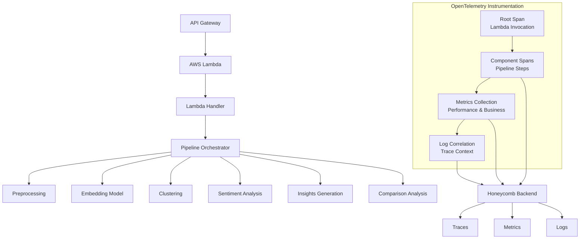

# OpenTelemetry Instrumentation Architecture

## System Overview



## Span Hierarchy

```
lambda_invocation (root span)
├── request_parsing
├── pipeline_orchestration
│   ├── preprocessing
│   ├── embedding_generation
│   ├── clustering_analysis
│   ├── sentiment_analysis
│   └── insights_generation
└── response_formatting
```

## Key Attributes per Span Level

### 1. Lambda Invocation (Root Span)
- `aws.lambda.function_name`
- `aws.lambda.function_version` 
- `aws.lambda.invoked_arn`
- `request.type` (standalone/comparison)
- `job.id`
- `sentence.count.total`

### 2. Pipeline Orchestration Span
- `pipeline.type` (standalone/comparison)
- `dataset.baseline.size`
- `dataset.comparison.size` (if applicable)
- `parallel.execution` (true/false)

### 3. Component Spans
#### Embedding Generation
- `embedding.model.name`
- `embedding.dimension`
- `embedding.batch.size`
- `embedding.duration.per.sentence`

#### Clustering Analysis
- `clustering.algorithm`
- `cluster.count`
- `noise.points.count`
- `silhouette.score`

#### Sentiment Analysis
- `sentiment.analyzer.type`
- `sentiment.distribution.positive`
- `sentiment.distribution.negative`
- `sentiment.distribution.neutral`

#### Insights Generation
- `insights.generated.count`
- `insights.average.length`
- `cluster.title.generated` (true/false)

## Metrics Design

### Counter Metrics
```python
text_analysis_requests_total{type="standalone", status="success"}
text_analysis_requests_total{type="comparison", status="error"}
text_analysis_sentences_processed_total
text_analysis_clusters_generated_total
```

### Histogram Metrics
```python
text_analysis_request_duration_seconds{type="standalone"}
text_analysis_pipeline_embedding_duration_seconds
text_analysis_pipeline_clustering_duration_seconds
text_analysis_pipeline_sentiment_duration_seconds
```

### Gauge Metrics
```python
text_analysis_active_requests
text_analysis_memory_usage_bytes
text_analysis_cluster_size_average
```

## Configuration Matrix

| Environment | Sampling Rate | Batch Size | Export Interval |
|-------------|---------------|------------|-----------------|
| Development | 100%          | 10         | 5 seconds       |
| Staging     | 50%           | 50         | 10 seconds      |
| Production  | 10%           | 100        | 30 seconds      |

## Error Handling Strategy

### Graceful Degradation
```python
try:
    span = tracer.start_span("operation")
    # Business logic
    span.set_status(Status(StatusCode.OK))
except Exception as e:
    if span:
        span.record_exception(e)
        span.set_status(Status(StatusCode.ERROR, str(e)))
    # Re-raise for business logic
    raise
finally:
    if span:
        span.end()
```

### Fallback Exporters
1. Primary: Honeycomb OTLP HTTP
2. Fallback: Console exporter (for debugging)
3. Emergency: Local file exporter (if network issues)

## Performance Considerations

### Span Creation Overhead
- Use `start_as_current_span()` context manager
- Limit custom attributes to essential fields
- Avoid complex computations in span creation

### Memory Management
- Configure appropriate batch sizes
- Implement span processor limits
- Monitor OpenTelemetry SDK memory usage

### Cold Start Impact
- Initialize OpenTelemetry at module level
- Use lazy initialization for exporters
- Consider AWS Lambda extensions for heavier workloads

## Testing Strategy

### Unit Tests
- Mock tracer provider
- Verify span creation and attributes
- Test error handling scenarios

### Integration Tests
- Use in-memory span exporter
- Validate trace context propagation
- Test metrics collection

### Performance Tests
- Baseline without telemetry
- Measure with telemetry enabled
- Validate acceptable overhead (<5%)

## Deployment Checklist

### Phase 1: Foundation
- [ ] Add OpenTelemetry dependencies
- [ ] Configure environment variables
- [ ] Create telemetry utility module
- [ ] Instrument Lambda handler

### Phase 2: Pipeline Instrumentation  
- [ ] Add spans to PipelineOrchestrator
- [ ] Instrument key components
- [ ] Implement basic metrics
- [ ] Update logging with trace context

### Phase 3: Validation
- [ ] Test in development environment
- [ ] Verify Honeycomb data ingestion
- [ ] Performance regression testing
- [ ] Update documentation

### Phase 4: Production Rollout
- [ ] Deploy to staging with 100% sampling
- [ ] Monitor for issues
- [ ] Reduce sampling rate for production
- [ ] Configure alerts and dashboards

## Monitoring the Monitor

### Key Health Metrics
- OpenTelemetry exporter success rate
- Span export latency
- Memory usage of telemetry system
- Error rates in span creation

### Alerting Rules
- High error rate in span exports (>5%)
- High memory usage by OpenTelemetry (>100MB)
- Span export latency > 1 second
- Missing traces for > 1% of requests

This architecture provides comprehensive observability while maintaining performance and reliability.